# Beforbim — Entity Relationship Diagram (ERD) (Phase 2 Final)
**Database Engine:** MySQL 8.4  
**Format:** Mermaid Diagram & Relational Cardinality Reference  

---

## 1. Visual Entity Relationship Diagram

```mermaid
erDiagram
    USERS ||--o{ ROLE_USER : "has"
    ROLES ||--o{ ROLE_USER : "assigned_to"
    ROLES ||--o{ PERMISSION_ROLE : "grants"
    PERMISSIONS ||--o{ PERMISSION_ROLE : "assigned_to"

    USERS ||--o{ DEVICE_SESSIONS : "authenticates_via"
    USERS ||--o{ AUDIT_LOGS : "acts_as_actor"
    USERS ||--o{ WARNINGS_AND_RESTRICTIONS : "receives"
    USERS ||--o{ SUPPORT_TICKETS : "opens"
    USERS ||--o{ SUPPORT_TICKETS : "assigned_to_staff"
    SUPPORT_TICKETS ||--o{ TICKET_MESSAGES : "contains"
    TICKET_MESSAGES ||--o{ TICKET_ATTACHMENTS : "includes"

    USERS ||--o{ COURSES : "instructs"
    CATEGORIES ||--o{ COURSES : "categorizes"
    CATEGORIES ||--o{ CATEGORIES : "parent_of"

    COURSES ||--o{ COURSE_SECTIONS : "contains"
    COURSE_SECTIONS ||--o{ LESSONS : "contains"
    LESSONS ||--o{ LESSON_RESOURCES : "attaches"
    LESSONS ||--o{ LESSON_CONTENTS : "has"

    COURSES ||--o{ COURSE_REVIEWS : "reviewed_by"
    USERS ||--o{ COURSE_REVIEWS : "writes"

    COURSES ||--o{ COURSE_ANNOUNCEMENTS : "announces"
    USERS ||--o{ COURSE_ANNOUNCEMENTS : "authored_by"

    COURSES ||--o{ COURSE_DISCUSSIONS : "contains"
    LESSONS ||--o{ COURSE_DISCUSSIONS : "referenced_in"
    USERS ||--o{ COURSE_DISCUSSIONS : "posts"
    COURSE_DISCUSSIONS ||--o{ COURSE_DISCUSSIONS : "replies_to"

    USERS ||--o{ CARTS : "owns"
    CARTS ||--o{ CART_ITEMS : "contains"

    USERS ||--o{ ORDERS : "places"
    ORDERS ||--o{ ORDER_ITEMS : "contains"

    ORDERS ||--o{ PAYMENTS : "paid_via"
    PAYMENTS ||--o{ TRANSACTIONS : "settled_in_ledger"
    USERS ||--o{ PAYMENTS : "verified_by_admin"

    USERS ||--o{ ENROLLMENTS : "holds"
    TRANSACTIONS ||..o{ ENROLLMENTS : "unlocks_via_workflow"

    USERS ||--o{ LESSON_PROGRESS : "records"
    LESSONS ||--o{ LESSON_PROGRESS : "tracked_for"

    COURSES ||--o{ ASSIGNMENTS : "includes"
    ASSIGNMENTS ||--o{ ASSIGNMENT_SUBMISSIONS : "receives"
    USERS ||--o{ ASSIGNMENT_SUBMISSIONS : "submits"

    COURSES ||--o{ ASSESSMENTS : "evaluates"
    LESSONS ||--o| ASSESSMENTS : "optional_attachment"
    ASSESSMENTS ||--o{ ASSESSMENT_QUESTIONS : "composed_of"
    ASSESSMENTS ||--o{ ASSESSMENT_ATTEMPTS : "attempted_via"
    USERS ||--o{ ASSESSMENT_ATTEMPTS : "takes"
    ASSESSMENT_ATTEMPTS ||--o{ EXAM_SECURITY_LOGS : "generates"

    COURSES ||--o{ LIVE_CLASSES : "schedules"
    USERS ||--o{ LIVE_CLASSES : "hosts"
    LIVE_CLASSES ||--o{ LIVE_CLASS_ATTENDANCES : "records"
    USERS ||--o{ LIVE_CLASS_ATTENDANCES : "attends"

    USERS ||--o{ CERTIFICATES : "awarded_to"
    COURSES ||--o{ CERTIFICATES : "certifies"
    ENROLLMENTS ||--|| CERTIFICATES : "completes"

    USERS {
        bigint id PK
        uuid uuid UK
        string name
        string email UK
        string phone
        string avatar
        string password
        string status
        timestamp email_verified_at
        timestamp phone_verified_at
        timestamp last_login_at
    }

    COURSE_REVIEWS {
        bigint id PK
        bigint course_id FK
        bigint student_id FK
        tinyint rating
        text review_text
        string status
    }

    COURSE_ANNOUNCEMENTS {
        bigint id PK
        bigint course_id FK
        bigint instructor_id FK
        string title
        text content
        timestamp published_at
    }

    COURSE_DISCUSSIONS {
        bigint id PK
        bigint course_id FK
        bigint user_id FK
        bigint lesson_id FK
        bigint parent_id FK
        text message
        string status
    }
```

---

## 2. Cardinality & Relational Integrity

| Parent Entity | Child Entity | Cardinality | FK Constraint | Integrity Rule |
| :--- | :--- | :---: | :---: | :--- |
| `courses` | `course_reviews` | $1:N$ | `CASCADE` | Unique per `(course_id, student_id)`. Enrolled students only. |
| `courses` | `course_announcements` | $1:N$ | `CASCADE` | Deleted when parent course is purged. |
| `courses` | `course_discussions` | $1:N$ | `CASCADE` | Threaded Q&A via self-referencing `parent_id`. |
| `users` | `course_reviews` | $1:N$ | `CASCADE` | Reviews authored by student. |
| `users` | `course_announcements` | $1:N$ | `CASCADE` | Announcements authored by instructor. |
| `users` | `course_discussions` | $1:N$ | `CASCADE` | Thread posts authored by user. |
