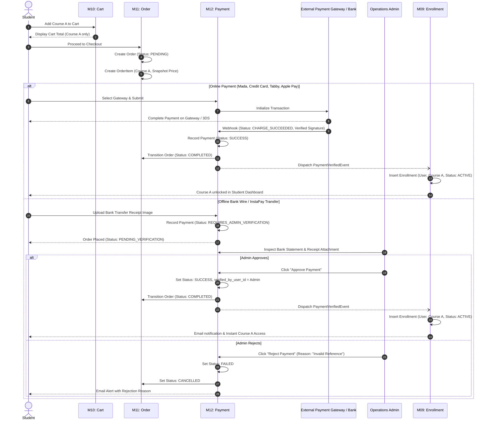
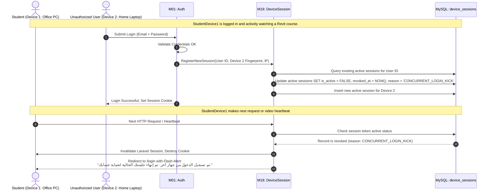
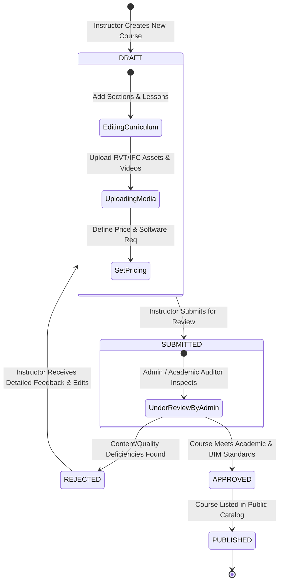
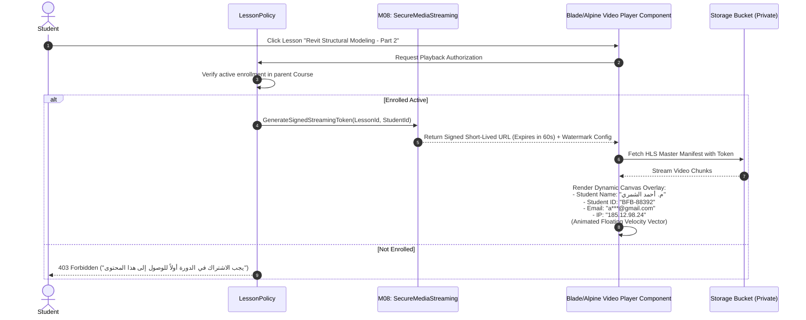
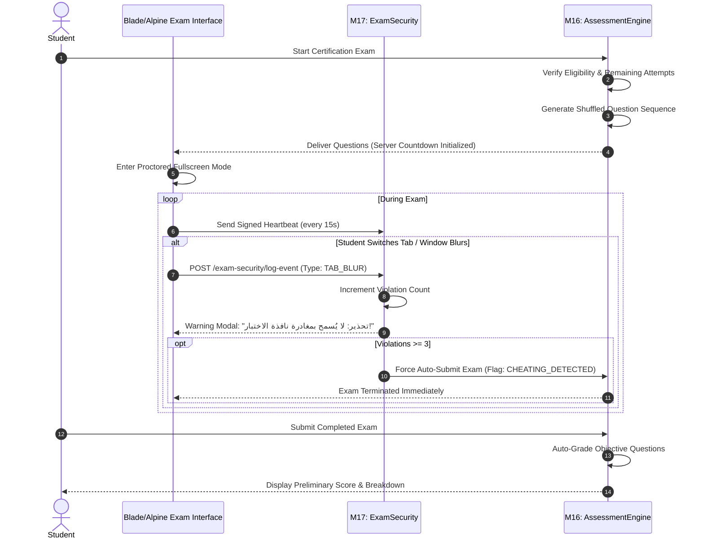

# Beforbim — User Flows & State Transition Specifications
**Platform:** Beforbim Engineering LMS  
**Audience:** Technical Engineers, Students, Instructors, Operations Staff  

---

## 1. Flow 1: Course Enrollment & Payment Verification (Zero Leaks)

This flow enforces two fundamental business rules:
1. **One course purchase unlocks ONLY that specific course.**
2. **Access is strictly gated behind verified payment.**

---

## 2. Flow 2: Single Active Device Session Enforcement (Anti-Piracy)

Ensures that student credentials cannot be shared with colleagues or public groups.

---

## 3. Flow 3: Course Creation & Admin Quality Approval Workflow

Ensures instructors can only manage their own courses and cannot publish directly to the public store without academic audit.

### Strict Boundaries:
- `InstructorCourseController`: Queries always scoped by `where('instructor_id', auth()->id())`.
- Route policies strictly prevent Instructor X from viewing, editing, or querying courses authored by Instructor Y.

---

## 4. Flow 4: Dynamic Watermarked Video Delivery & Content Security

Protects high-value proprietary engineering lectures from screen capturing.

---

## 5. Flow 5: High-Stakes Exam Proctoring & Integrity Flow

Protects engineering certification exams against cheating, browser switching, and unauthorized external aid.

